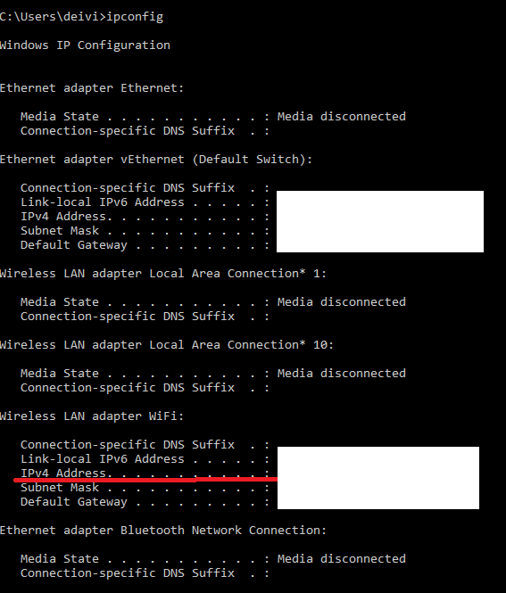
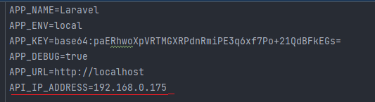

# Application setup

Requirements: `docker`

## Steps:

#### Clone repo

`git clone https://github.com/Upsas/group-maker-for-teachers.git`

#### Go to dir and run docker-composer

`cd group-maker-for-teachers/ && docker-compose up -d --build`

#### Install composer amd npm dependencies in docker container

First go to container:

`docker exec -it application bash`

Second run install commands

`composer install && npm install`

#### Set up .env file

`change .env.example to .env`

#### Run migrations and seeders inside container

`php artisan migrate:fresh --seed`

#### Generate App key

`php artisan key:generate`

#### Last step set up API call env

Open terminal. For example in windows press start + r and type cmd

After that copy IPv4 Address in Wireless LAN adapter WiFi:
for example `192.168.208.1`

Copy address and copy to your .env file for example

#### That's all

Go to http://localhost

#### Login info

email `test1@gmail.com` password `password`

email `test2@gmail.com` password `password`

email `test3@gmail.com` password `password`

email `test4@gmail.com` password `password`

email `...` password `password`

email `...` password `password`

email `test20@gmail.com` password `password`

