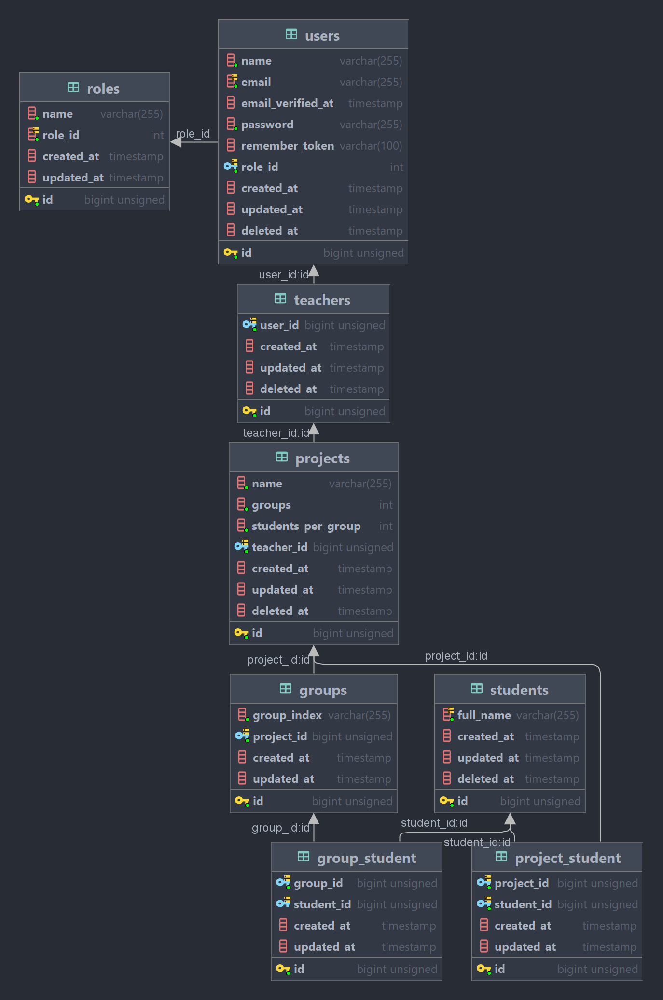
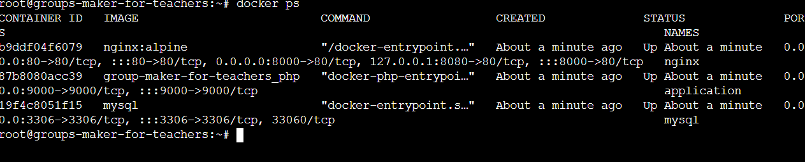

# Technical desicions and solutions

## Tech stack languages/frameworks:

<table>
<thead>
<tr>
<td>Language</td>
<td>Framework</td>
<td>Usage</td>
</tr>
</thead>
<tbody>
<tr>
<td>PHP</td>
<td>Laravel</td>
<td>Architecture/Main Logic (routing, validation etc.)</td>
</tr>
<tr>
<td>JS</td>
<td>Livewire</td>
<td>Frontend/Ajax</td>
</tr>
<tr>
<td>CSS</td>
<td>Tailwind</td>
<td>Style</td>
</tr>
</tbody>
</table>

Server: `nginx`

Database: `mysql` 

## Version control

`Git/GitHub` also small pipeline with `GitHub Actions`

## Deployment

`Docker/Docker-compose` (also for development) and `DigitalOcean`

# Solutions

## DB relation diagram



### A lot of main functionality was achieved by DB relations.

Especially by Many-to-many relations. For example project_student (to get all students by project) without duplications 
and much more.

### Solution 1: Create project with groups summary

<b>Every group has Many to one relation to project.</b>
```
 public function project(): HasOne
    {
        return $this->hasOne(Project::class, 'id', 'project_id');
    }
```

<b>Type data -> validate -> add project with groups.</b>

```
   $storedProject = Project::create($validatedData);

        for ($i = 1; $i <= $validatedData['groups']; $i++) {
            Group::create(['group_index' => $i, 'project_id' => $storedProject->id]);
        }
        
        return $storedProject;
```

### Solution 2: Add student functionality. BONUS: with API request

<b>In Livewire calling (with inbuilt Guzzle) internal API route to achieve ajax functionality</b>

```
    private function storeAPIRequest(): PromiseInterface|Response
    {

        $route = route('student.store-api');
        $env = env('API_IP_ADDRESS');

        if ($env) {
            $route = "http://$env/api/student/store";
        }

        return Http::acceptJson()->withToken((Auth::user())
            ->createToken('sanctumValidationToken')->plainTextToken)
            ->asForm()
            ->post($route, [
                'project_id' => $this->project->id,
                'full_name' => $this->full_name,
            ]);
    }
```

### Solution 3: All students visible on a list

<b>Key to achieve this functionality is relations</b>

First validate if project belongs to teacher
```
        $teacherId = $this->teacherRepo->where('user_id', Auth::id())->first()->id;
        if (!in_array($id, $this->projectRepo->where('teacher_id', $teacherId)->pluck('id')->toArray())) {
            return back();
        }

        return view('project-page', ['project' => $this->projectRepo->find($id)]);
    }
```
And then with relation get all students. <b>Relation with project not teacher/user</b>
```
    public function students(): BelongsToMany
    {
        return $this->belongsToMany(Student::class)->withTimestamps();
    }
```

### Solution 4: Teacher delete student, and it is removed from group and project

<b>Many to many relations project_student and group_student helps to achieve this functionality</b>

<b>Student Model</b>

```
    public function projects(): BelongsToMany
    {
        return $this->belongsToMany(Project::class)->withTimestamps();
    }

    public function groups(): BelongsToMany
    {
        return $this->belongsToMany(Group::class)->withTimestamps();
    }
```

<b>And detach</b>

```
        $model = $this->find($id);
        $model->groups()->detach();
        $model->projects()->detach();
        $model->delete(); 
```

### Solution 5: Assign student to group

<b>Using Livewire and relations it's possible to achieve it in ajax style</b>

Main logic is to assign or sync students in groups 

```
        if ($studentGroups->get()->isEmpty()) {
            $studentGroups->attach($currentGroupId);
        } else {
            $studentGroups->sync($currentGroupId);
        }
```

### Solution 6: Deployment

<b> For deployment I used DigitalOcean with Docker.</b>

<b>Inside DigitalOcean Server I installed Docker and run containers.



Site is: http://www.groups-assigner.online/

Logins are same as [Logins in setup](/docs/setup.md)

### BONUS: Refresh page every 10 seconds. 

<b>Livewire + vannila js helps to achieve it in ajax style</b>

<b> JS part </b>

```
        const refreshData = function() {
            setTimeout(() => {
                refreshData();
                Livewire.emit('renderStudentTable');
                Livewire.emit('refreshProjectInfoTable');
                Livewire.emit('renderGroupTables');
            }, 10000);
        }
        refreshData();
```
<b> Livewire part to refresh needed components </b>

```
    protected $listeners = ['refreshProjectInfoTable' => '$refresh'];
    protected $listeners = ['renderGroupTables' => '$refresh'];
    protected $listeners = ['renderStudentTable' => '$refresh'];
```

### BONUS: Tests

Run tests in docker container/terminal. <b>Needs to be in `./applicaiton` directory
 and run command </b>

`vendor/bin/phpunit`

<b>Test example </b>

```
    public function testRenderMessage(): void
    {
        DB::beginTransaction();

        $this->actingAs(ModelCreationHelper::createUser());

        Livewire::test(FlashMessage::class)
            ->call('renderFlashMessage', 'message')
            ->assertSet('flashMessageDisplay', 'block')
            ->assertSet('bgColor', 'bg-green-400')
            ->assertSet('message', 'message')
            ->assertSee('message');

        DB::rollBack();
    }
```
